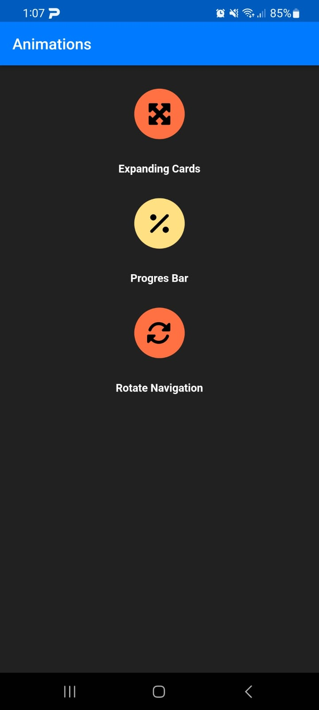
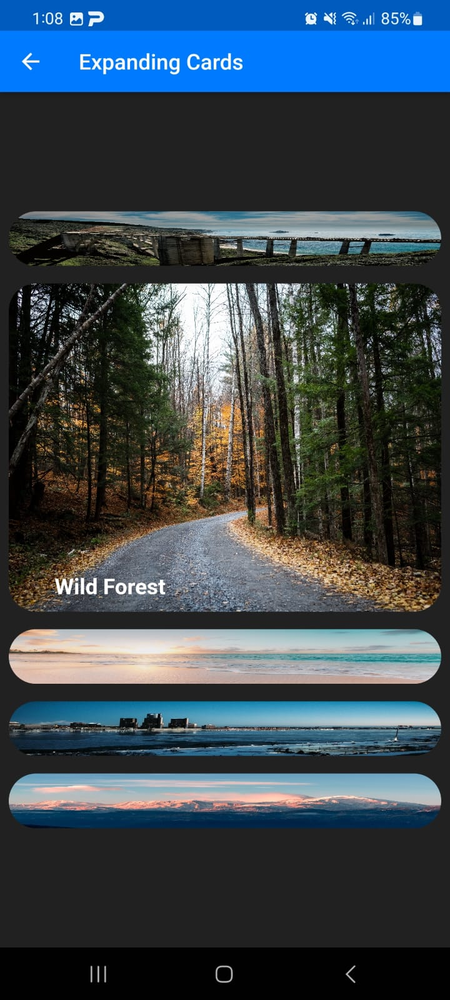
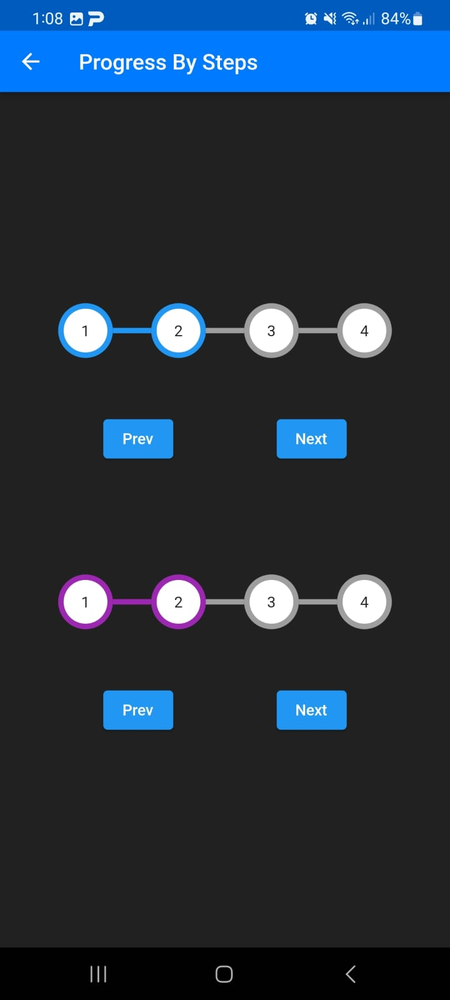
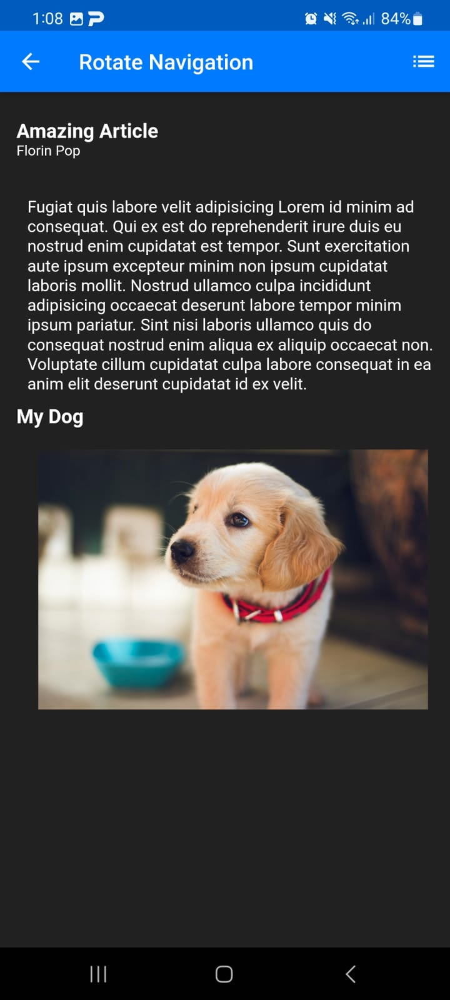

# Basic Animations

Some basic animation samples to practice

## Demo

## Feature Roadmap
- Add more animation
- Add more screens

## Getting Started
1. Clone the repository

2. Open the project in your preferred IDE.

3. Run the app on an emulator or physical device.

